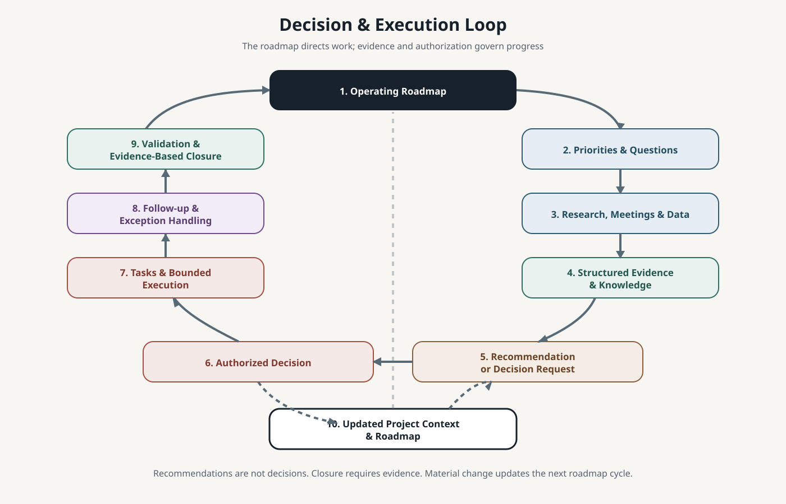

# Architecture

Iñaqui AI OS is a continuity architecture around AI work. It preserves enough durable context for a person or replacement AI environment to understand a project, locate its sources, respect its boundaries, and continue useful work.

It is not a universal database and does not attempt to copy every source into one repository.

## Architectural layers

### 1. Governance and boundaries

Governance defines what may be read, changed, disclosed, automated, or published. It also identifies where authority remains human, corporate, professional, contractual, or source-system specific.

Technical access is not authority. A provider that can perform an action is not necessarily authorized to perform it.

### 2. Durable operating context

The OS layer contains stable, portable material such as:

- operating principles;
- project entrypoints;
- source maps;
- decision and authority boundaries;
- reusable workflows;
- dated handoffs;
- validation and recovery guidance.

Markdown and Git are useful here because they are inspectable, portable, diffable, and independent of any model. Git is authoritative only for the material intentionally governed there.

### 3. Project operating environments

Each project can define its own:

- purpose and scope;
- operating instructions;
- provider or tool lanes;
- source map;
- workflows and capabilities;
- decision boundaries;
- current handoff;
- verification requirements.

Project detail stays with the project. Only stable routing and continuity context needs to be shared with the broader OS.

### 4. Canonical source systems

Canonical information can remain distributed. Depending on the project, an authoritative source may be:

- a Git repository;
- a document store;
- a database or business system;
- a GIS workspace;
- an approved professional system;
- another named durable source.

A tool is not canonical merely because it contains relevant information. Authority is assigned for a defined scope. A meeting transcript may be evidence of a commitment while a governed task record holds its operational status. A generated dashboard may be a useful view while the underlying dataset remains authoritative.

### 5. Replaceable runtimes

ChatGPT, Claude/Cowork, Codex, and other providers are execution environments. A provider may offer a different combination of reasoning, tools, connectors, automation, or interface. Those differences matter operationally, but durable project continuity should not depend on the survival of one provider's conversation history or memory.

## Source-authority model


A source is canonical when it is explicitly designated as authoritative for a defined scope. The designation should answer:

- What information does this source govern?
- Who owns or controls it?
- How is current state verified?
- What is the approved access path?
- What happens if the source conflicts with a snapshot or another system?

Conversations, meeting systems, email, and model memory can provide context or evidence. They do not become canonical automatically. Generated summaries and dashboards are also non-canonical unless explicitly promoted through the applicable governance process.

When sources conflict, the operator should surface the contradiction, identify the applicable authority, and seek resolution. It should not silently merge incompatible states.

## Snapshots, handoffs, and live state

A handoff is a dated continuity artifact. It records what an operator understood at a point in time:

- current objective;
- material state;
- important decisions;
- open questions and risks;
- source locations by safe category;
- recommended next action;
- validation still required.

A handoff is not live synchronization. If current state affects a decision or consequential action, the relevant canonical source must be checked again.

## Knowledge and confidence

Durable knowledge should preserve enough provenance to distinguish:

- observation from interpretation;
- evidence from conclusion;
- fact from hypothesis;
- recommendation from decision;
- task state from evidence confidence;
- historical snapshot from current state.

Confidence describes the strength of evidence. Status describes lifecycle position. They are separate dimensions.

## Decision and action lifecycle

```text
Evidence
→ Recommendation
→ Review
→ Decision
→ Authorized Action
→ Implementation
→ Validation
→ Durable Closure
```

Not every low-risk activity requires a formal ceremony at every stage, but later stages do not silently replace earlier ones. Implementation does not prove that an outcome worked, and a recommendation does not establish authorization.

## Operating roadmap loop



The public operating loop is:

```text
Operating Roadmap
→ Priorities and Questions
→ Research, Meetings and Data
→ Structured Evidence and Knowledge
→ Recommendation or Decision Request
→ Authorized Decision
→ Tasks and Bounded Execution
→ Follow-up and Exception Handling
→ Validation and Evidence-Based Closure
→ Updated Project Context and Roadmap
```

The roadmap provides direction; AI helps maintain operational memory, evidence, execution and follow-up around it.

- Questions organize uncertainty.
- Research, meetings and data produce evidence.
- Structured knowledge preserves provenance and confidence.
- Recommendations are not decisions.
- Tasks implement authorized work.
- Follow-up may be manual or automated.
- Closure requires evidence.
- Material changes feed back into project context and the roadmap.

## Manual core, scoped automation

The OS core is intentionally simple and manual. A project may automate meeting processing, research collection, task updates, follow-up, testing, or artifact production when the workflow, authority, error handling, and validation criteria are clear.

Automation should remain bounded by the project's sources and permissions. It must expose exceptions and preserve a human path for consequential decisions.

## What the architecture avoids

- treating model memory as an institutional record;
- copying all operational data into the OS;
- assuming a pointer is a backup;
- assuming a snapshot is current;
- assigning authority through tool access;
- treating generated output as verified truth;
- creating automation before the workflow and failure modes are understood;
- allowing project detail to expand into an unbounded central knowledge store.
