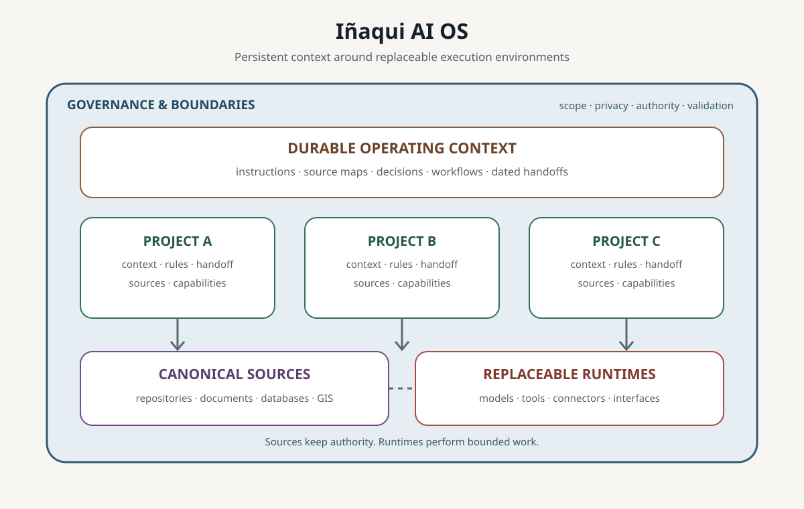
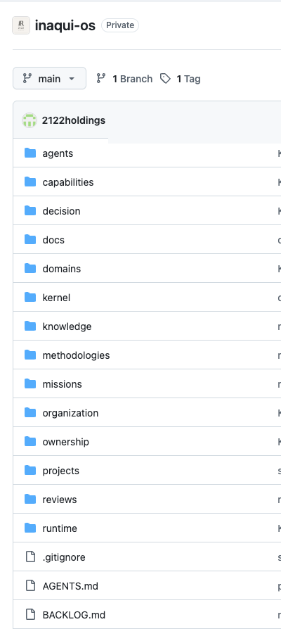
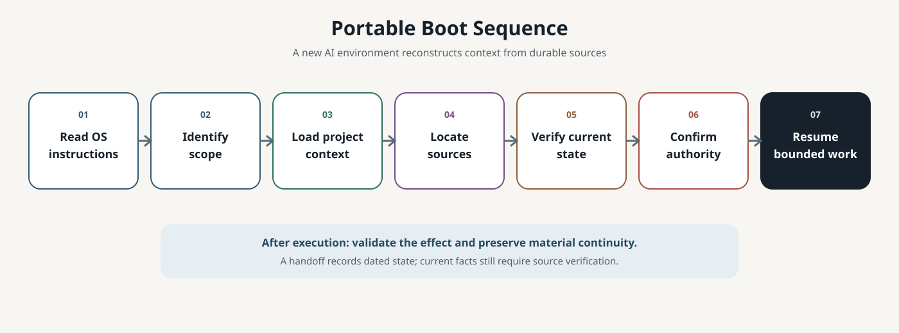
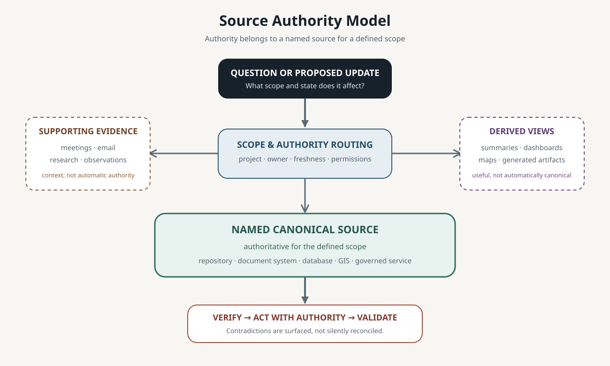

# Iñaqui AI OS

> Models are interchangeable. Context is persistent. Sources remain canonical. Projects retain memory. Capabilities compound.

Iñaqui AI OS is the operating architecture I use to run AI-native work across different projects, models and tools.

It gives each project persistent context, canonical sources, operating rules and reusable workflows, while allowing me to use ChatGPT, Claude/Cowork, Codex or specialized tools depending on the job.

The model can change without rebuilding the project from scratch.

In practice, I have used this architecture across business operations and software engineering — from meeting intelligence, research, GIS and follow-up to architectural decisions, engineering workflows and verification.

Interchangeable refers to continuity across execution environments, not equivalent model capabilities.

## Architecture overview



The architecture separates the durable memory of a project from the tools used to execute its work. Each project can keep its own context, rules, source map, workflows and handoffs while drawing current information from the systems that are authoritative for it.

The durable core is intentionally simple: manual, Markdown-first and version-controlled. Project environments can add automation where it creates value.

## Built and used in practice

This public repository abstracts a private operating architecture that has been used across multiple real project environments.



*The private Iñaqui OS repository organizes persistent context, capabilities, decisions, knowledge, projects and operating rules independently from the AI runtime executing the work.*

## What this looks like in practice

### POW Water — Business Operations

POW Water demonstrates the architecture in a business operating environment. It connects an operating roadmap with meeting intelligence, evidence-based research, commercial account intelligence, geospatial intelligence, task orchestration, follow-up, standardized artifacts and evidence-based closure.

The project can use different AI and specialist tools for different kinds of work while keeping operational sources, authority and project memory distinct from any one provider.

[Explore the sanitized POW Water case study](case-studies/pow-water.md).

### PhotoVault — Software Engineering

PhotoVault demonstrates the same architecture in a repository-centered engineering environment. Persistent project context and architectural decisions guide experiments, specialized engineering roles and workflows, testing, verification and evidence-based closure.

Engineering work can move between execution environments without making conversation history the source of truth or losing the decisions and evidence that shaped the project.

[Explore the sanitized PhotoVault case study](case-studies/photovault.md).

Together, the two projects show how the same continuity architecture can support substantially different operating environments without forcing them into one workflow or source system.

## From roadmap to execution

```text
Operating Roadmap
→ Priorities & Questions
→ Meetings, Research & Data
→ Structured Knowledge
→ Decisions & Tasks
→ Execution
→ Follow-up
→ Validation & Closure
→ Updated Context
↺
```

The roadmap provides direction. AI helps maintain operational memory, evidence, execution and follow-up around it. Follow-up may be manual or automated depending on the project.

Underneath that execution loop, organizational authority remains separate:

```text
Evidence
→ Recommendation
→ Review
→ Decision
→ Authorized Action
→ Implementation
→ Validation
→ Durable Closure
```

Recommendations are not decisions. Automation does not create authority. Closure requires evidence.

## Provider portability

ChatGPT, Claude/Cowork, Codex or another environment can be selected according to the work. One may be better suited to connected business workflows, another to research or synthesis, and another to repository-based engineering.

No LLM is the system of record.

Changing or losing a provider should mean replacing an execution environment, not reconstructing the project's institutional memory.



A replacement environment resumes by reading the OS instructions, identifying the project and scope, loading project context, locating canonical sources, verifying current state, confirming authority and then continuing bounded work.

[Read the portability protocol](PORTABILITY.md).

## Source-of-truth model

The architecture uses three distinct layers:

### Durable operating context

Git and Markdown hold versioned context where they are designated for that role: operating rules, architecture, project maps, workflows, decisions and dated handoffs.

### Canonical operational information

Current operational information remains in the authoritative system for that information. Depending on the project, that may be a repository, document store, database, GIS environment, meeting system or another governed source.

Git does not need to contain everything. A handoff is a dated snapshot, not live synchronization, and material current state must be verified against its canonical source.

### AI execution environment

Models and tools provide reasoning, research, drafting, coding, analysis or bounded execution. Their conversations and memory can supply context or evidence, but they do not automatically become canonical sources.



## Reusable capabilities

The architecture brings together nine reusable capabilities:

- Meeting Intelligence
- Evidence-Based Research
- Commercial Account Intelligence
- Geospatial Intelligence Automation
- Decision & Task Orchestration
- Automatic Follow-up
- Artifact Generation
- Source-of-Truth & Confidence Governance
- Engineering Execution & Verification

Capabilities developed or proven in one project can be adapted and reused in another while each project retains its own context, sources and authority boundaries.

[Explore the capability model](CAPABILITIES.md).

## Governance and authority

AI can collect evidence, structure knowledge, prepare recommendations, execute bounded work and validate results. It does not gain decision authority merely because it has access or technical capability.

Applicable human, corporate, professional and source-system authority remains required. Consequential actions must be authorized within the relevant project boundary, and conflicting sources or unclear authority should be surfaced rather than silently resolved.

The architecture keeps evidence, recommendations, decisions, execution and validation separate so that speed does not erase accountability.

## Explore the repository

- [How I Work With AI](HOW_I_WORK_WITH_AI.md) — an operator's perspective on using persistent context to connect strategy, information and execution
- [Architecture](ARCHITECTURE.md) — system layers, source authority, handoffs and the operating loop
- [Portability](PORTABILITY.md) — how another AI environment resumes a project
- [Capabilities](CAPABILITIES.md) — the nine reusable operating capabilities
- [POW Water](case-studies/pow-water.md) — sanitized business-operations case study
- [PhotoVault](case-studies/photovault.md) — sanitized software-engineering case study
- [Security and boundaries](SECURITY_AND_BOUNDARIES.md) — disclosure and source-handling rules
- [Contributing](CONTRIBUTING.md) — contribution and review expectations

## Public boundary

This repository is a public architectural explanation, not the private operating repository. Examples and case studies are deliberately sanitized; canonical project data remains in its authorized source systems.

[Read the full security and disclosure boundaries](SECURITY_AND_BOUNDARIES.md).
