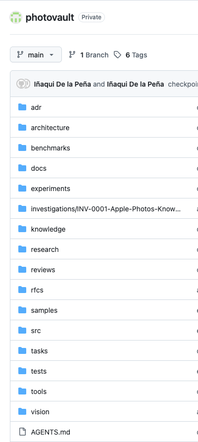
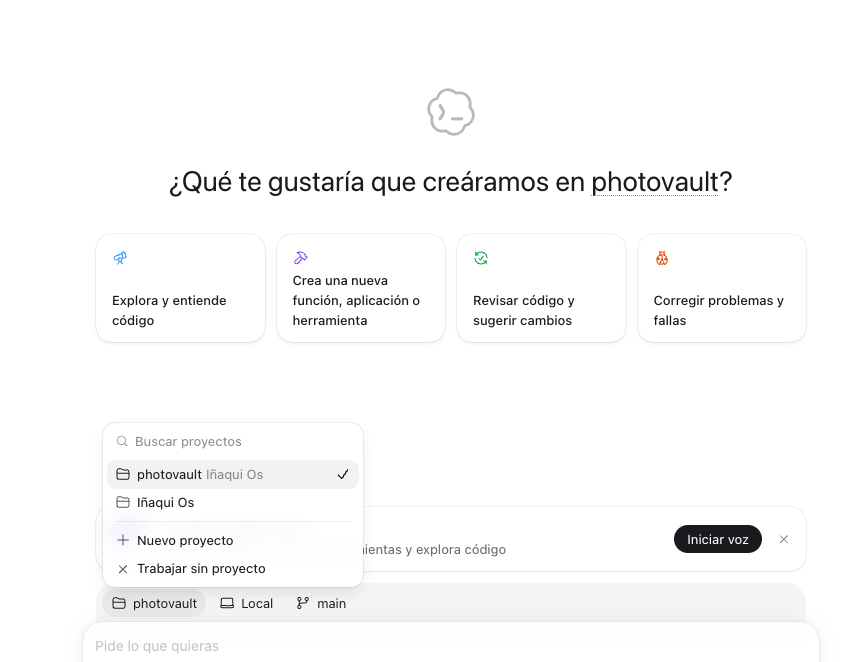

# PhotoVault: Software Engineering Case Study

PhotoVault illustrates how a software project can retain engineering memory in its own repository while using replaceable AI environments for planning, implementation, research, review, and verification.

This case study is deliberately abstracted. It does not expose private repository locations, media, metadata, fixtures, source exports, experiment outputs, protected architecture details, or current implementation state.

## The operating challenge

AI-assisted engineering can move quickly, but speed creates risk when:

- accepted architecture is buried in conversations;
- implementation begins before evidence exists;
- generated code is treated as correct without testing;
- experiments are confused with product decisions;
- one model's memory becomes an undocumented dependency;
- sensitive source data leaks into prompts, fixtures, logs, or public artifacts.

## Architectural response

The software project repository remains canonical for code and accepted engineering documentation. It can contain:

- project instructions;
- architecture decisions;
- engineering principles;
- current plans and tasks;
- research and investigation records;
- experimental code and results with clear status;
- tests and verification evidence;
- scoped handoffs.

The broader OS stores only enough context to locate the project, understand its boundary, identify the current work lane, and resume safely.

## Repository-centered engineering



The project repository preserves engineering state through explicit structures for architecture, decisions, research, experiments, investigations, tasks, tests and verification. This durable structure allows current work to inherit prior reasoning without depending on a model's conversation history.

## Evidence before implementation

An engineering question begins with a bounded uncertainty. Research, repository inspection, or an experiment produces evidence. That evidence can support a recommendation and review. An accepted decision then authorizes implementation within scope.

```text
Question
→ Investigation or Experiment
→ Evidence
→ Recommendation
→ Review
→ Accepted Decision
→ Bounded Implementation
→ Tests and Inspection
→ Validated Result
→ Durable Repository Update
```

Experiments remain experimental until reviewed and deliberately promoted. A successful command or generated implementation is not evidence that the full intended behavior is correct.

## Portable engineering workflow

When a new AI environment joins the project, it should:

1. read project-level instructions;
2. inspect the current repository and working state;
3. locate accepted architecture and decisions;
4. identify the relevant source code, tests, and evidence;
5. distinguish canonical, proposed, experimental, and historical material;
6. create a bounded plan;
7. implement only the authorized change;
8. review the diff and run relevant checks;
9. inspect behavior or generated artifacts;
10. update material decisions, evidence, and handoff state.

This workflow is portable even when providers expose different tools. A provider without a required capability should hand off the bounded operation rather than changing the project's source of truth.

## AI engineering environment



Repository-aware AI execution environments can enter the project through its durable context rather than depending on previous conversation history. Codex is shown here as an execution environment; the project repository, not Codex, remains canonical for engineering state.

## Engineering roles and verification

AI-assisted engineering may separate roles such as:

- repository orientation;
- architecture analysis;
- research and experimentation;
- implementation;
- code review;
- test execution;
- artifact inspection;
- security and privacy review;
- handoff preparation.

These are roles and capabilities, not automatic grants of autonomous identity or authority. Deployment, merging, deletion, disclosure, and production changes remain subject to project governance.

Verification should be proportional to risk and may include:

- targeted automated tests;
- type, lint, format, or static checks;
- diff review;
- integration and end-to-end tests;
- visual or artifact inspection;
- reproducibility checks;
- failure and recovery testing;
- comparison with accepted architecture and success criteria.

## Source-of-truth discipline

External systems can supply evidence without automatically becoming authoritative for project meaning. Generated classifications and AI suggestions remain proposals until reviewed through the project's accepted process.

The project should preserve unknown, conflicting, rejected, deferred, and unconfirmed states rather than forcing premature certainty.

## Boundaries demonstrated

- The project repository, not provider memory, holds engineering continuity.
- The OS points to the project rather than copying its code or detailed documentation.
- Evidence, architecture decisions, implementation, and verification remain separate.
- Experiments do not silently become production architecture.
- Sensitive assets and metadata stay outside public and general operating repositories.
- Human review remains essential for meaning-sensitive and consequential decisions.
