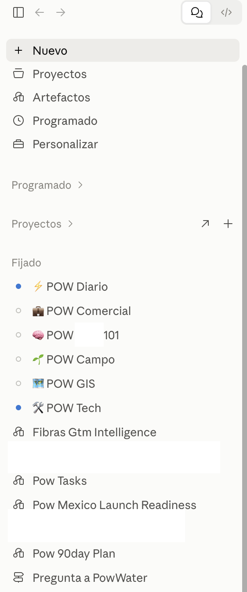
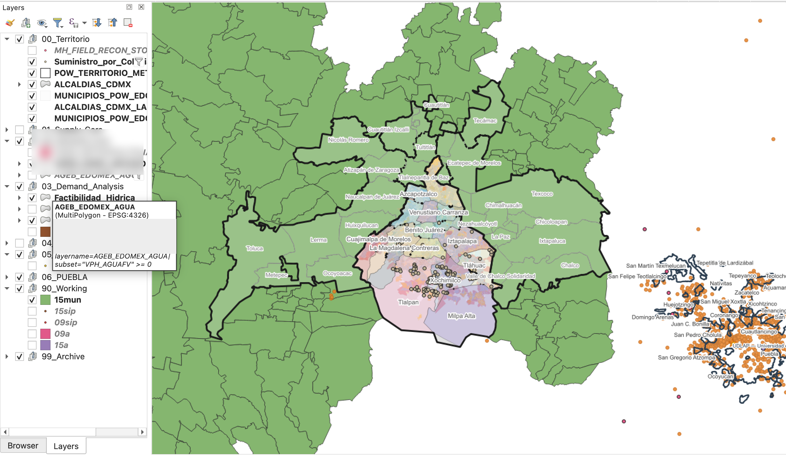

# POW Water: Business Operations Case Study

POW Water illustrates how a business project can use AI across multiple operating surfaces without making one provider or repository the universal source of truth.

This case study is deliberately abstracted. It does not describe current commercial state, contacts, contracts, pricing, vendors, datasets, internal decisions, tasks, locations, schedules, or technical configuration.

## The operating challenge

A business project can accumulate context across:

- an operating roadmap;
- meetings and communications;
- research and third-party evidence;
- shared documents;
- operational and commercial systems;
- tasks and follow-up;
- geospatial data and GIS tools;
- AI providers with different capabilities.

If the project relies on conversation memory alone, commitments become difficult to trace, research loses provenance, and provider replacement erases context. If everything is copied into one central repository, the project creates duplicate, stale, or improperly disclosed sources.

## Architectural response

The project operating layer preserves only the context needed to route and continue work:

- project purpose and scope;
- operating rules and authority boundaries;
- safe source categories;
- reusable workflows;
- material decisions and open questions at an appropriate level;
- a dated handoff;
- validation and next-action guidance.

Current operational details remain in their designated systems. AI environments use those sources only within their authorized roles.

## Operating environment



The project was divided into bounded working environments for different operating needs, including daily operations, commercial work, field work, GIS, technical work, task management and roadmap execution. This separation keeps each environment focused while the wider project architecture preserves continuity across them.

## Roadmap-centered operating loop

```text
Operating Roadmap
→ Priorities and Questions
→ Research, Meetings and Data
→ Structured Evidence and Knowledge
→ Recommendation or Decision Request
→ Authorized Decision
→ Tasks and Bounded Execution
→ Follow-up and Exception Handling
→ Validation and Evidence-Based Closure
→ Updated Project Context and Roadmap
```

The roadmap provides direction; AI helps maintain operational memory, evidence, execution and follow-up around it.

Questions organize uncertainty. Research, meetings and data produce evidence. Structured knowledge preserves provenance and confidence. Recommendations are not decisions. Tasks implement authorized work. Follow-up may be manual or automated. Closure requires evidence. Material changes feed back into project context and the roadmap.

## Meeting-to-execution pattern

A bounded meeting-intelligence workflow can:

1. process an authorized meeting record;
2. extract claims, questions, commitments, and proposed decisions;
3. preserve attribution and uncertainty;
4. compare proposed updates with the governed task and decision sources;
5. route changes for the required review or approval;
6. update authorized operational records;
7. follow up on unresolved items;
8. close work only when evidence supports the outcome.

The meeting record remains evidence. Discussion does not become a decision merely because an AI summarized it.

## Geospatial intelligence pattern

AI-assisted workflows ingest authorized provided data — public, proprietary, operational or third-party — together with geospatial files, documents, operational constraints and business objectives. They clean, transform and combine that information; build and maintain layered GIS environments; and convert geographic evidence into operational and commercial intelligence.

The pattern does not require public data. A project can use only authorized proprietary or operational inputs.

The workflow should preserve data provenance, licenses, coordinate systems, transformation history, layer dependencies, and validation evidence. Generated maps and commercial interpretations are derived artifacts; their publication and operational use remain subject to data rights and applicable authority.

## Geospatial intelligence in practice



GIS work combined supplied, public and otherwise authorized datasets with geospatial files, operational constraints and business questions in a layered analysis environment. The reusable pattern is:

```text
Data
→ Cleaning & Transformation
→ Layered GIS Environment
→ Geographic Analysis
→ Operational / Commercial Intelligence
```

The screenshot documents the working environment without asserting or disclosing any private commercial conclusion from the map.

## Provider roles

Different providers may support different bounded activities, such as:

- document and meeting synthesis;
- research and evidence structuring;
- task and follow-up workflows;
- data transformation and analysis;
- GIS scripting or validation;
- artifact generation;
- repository-based continuity work.

The provider is selected for the task. The project's sources, decisions, and durable memory remain outside provider identity.

## What compounds

Meeting intelligence produces structured evidence. Research strengthens or challenges it. Commercial and geospatial analysis turns evidence into decision support. Authorized decisions create tasks. Follow-up reveals exceptions. Validation supports closure. The resulting durable context improves the next operating cycle, regardless of which provider executes it.

## Boundaries demonstrated

- Business and personal contexts remain separate.
- Corporate information stays in approved corporate systems.
- AI access does not grant corporate authority.
- Handoffs summarize state without copying canonical source documents.
- Current state is verified before material decisions or actions.
- Automated workflows have bounded triggers, permissions, failure handling, and escalation.
- Private data and derived commercial intelligence are excluded from public documentation.
